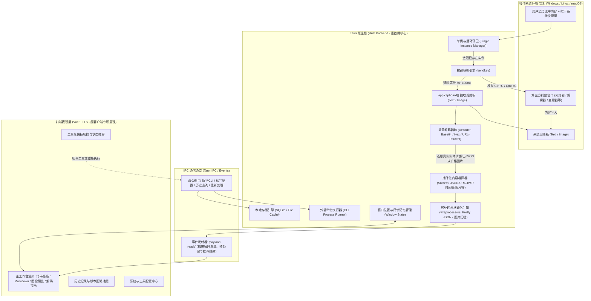
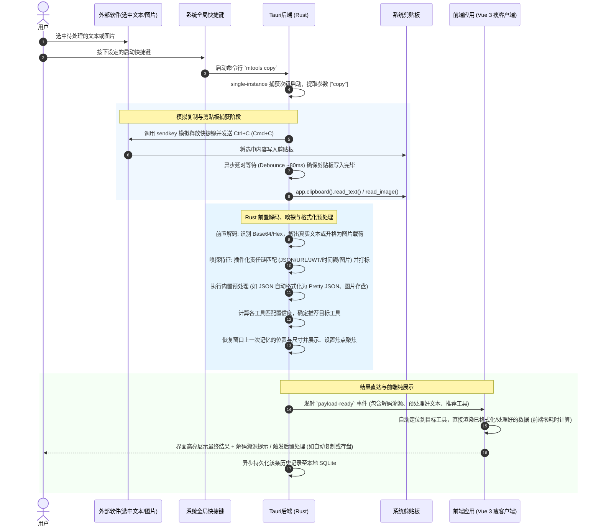

# 系统架构与核心时序设计 (System Architecture & Core Lifecycle)

## 1. 系统概述与技术选型

`mtools` 是一款基于 **Tauri v2 + Vue 3** 架构的桌面效率与工具分发软件。其核心形态为一个常驻或受快捷键激活的单例应用：当用户在操作系统任意软件中选中内容（文本、富文本、图片等）并按下快捷键后，软件被拉起，通过操作系统级模拟按键执行“复制”，获取剪切板载荷，利用智能路由引擎将其分发至最合适的目标工具，完成即时处理。

### 1.1 技术栈选型

- **Native 桌面容器**: Tauri v2
  - **跨平台核心 (Rust)**: 负责单例管理、模拟按键发送（`sendkey`）、系统剪贴板监听与读取、外部系统命令受控执行、原生窗口尺寸/位置状态持久化保存、本地 SQLite 数据库与文件系统操作。
  - **单例插件**: `tauri-plugin-single-instance`。
  - **剪贴板插件**: `tauri-plugin-clipboard-manager` + 原生增强。
- **前端表现层 (UI)**:
  - **框架**: Vue 3 (Composition API, `<script setup>`) + TypeScript。
  - **样式**: Tailwind CSS。
  - **运行时扩展引擎**: 纯 JS/TS 脚本执行器（支持内置及用户编写的自定义工具匹配函数和纯代码处理函数）。
- **数据持久化**:
  - 本地 SQLite (通过 Rust 端 `rusqlite` 或 Tauri SQL 插件) 存储历史记录、工具配置与全局设置。
  - 媒体文件缓存: 图片等大文件落盘于应用数据目录 `cache/images/`，数据库仅存储索引指针。

---

## 2. 软件分层架构

---

## 3. 完整启动与触发核心时序 (End-to-End Execution Flow)

当用户在任意外部软件中选中内容后，触发软件的核心时序如下：

---

## 4. 关键技术细节与工程考量

### 4.1 模拟按键时序与防竞争 (Race Condition Prevention)

1. **键状态复位**: 用户触发快捷键通常需要按下物理组合键（例如 `Super+Alt+C` 或 `Ctrl+Shift+C`）。在模拟系统 `Ctrl+C` 之前，必须确保物理辅助键已被释放或在模拟代码中做 KeyUp 处理，否则第三方应用可能接收到错误组合键。
2. **写剪贴板缓冲等待**: 外部软件将数据序列化至剪贴板不是即时完成的（特别是大文本或图片），因此后端在模拟复制后设置可配置的自适应延时（默认 `80ms`），并读取剪贴板版本号/Hash，防止读出旧的剪贴板遗留数据。

### 4.2 窗口行为与状态持久化 (Window State Persistence)

- 用户的明确决策：**普通桌面窗口，记住上一次位置与大小**。
- **实现机制**：
  - 利用 Tauri 的窗口事件监听 (`tauri::WindowEvent::Resized`, `tauri::WindowEvent::Moved`)。
  - 在应用退出或窗口失焦时，异步更新配置表存储的 `{ x, y, width, height, is_maximized }`。
  - 实例被 `copy` 唤起时：
    1. 若窗口处于最小化，调用 `window.unminimize()`；
    2. 若窗口处于隐藏，调用 `window.show()`；
    3. 调用 `window.set_focus()` 确保置于前台，同时恢复上次关闭时的矩形边界。

### 4.3 多进程与单例设计

- `tauri-plugin-single-instance` 在主进程启动时建立本地 IPC 套接字（Unix Domain Socket 或 Windows Named Pipe）。
- 当新进程带参数 `mtools copy` 启动时，将命令行参数发送给主进程，新进程立即退出，主进程回调接收到 `args` 并进入复制与激活流程。
