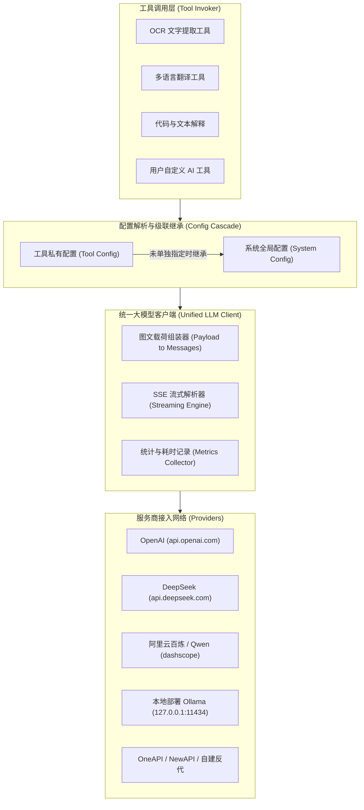
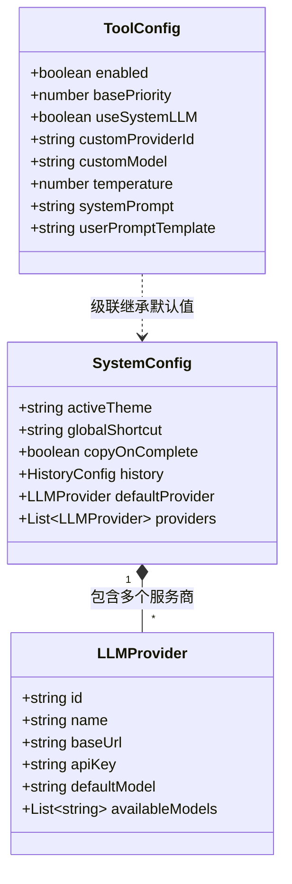

# 大模型体系与级联配置架构 (LLM Integration & Cascading Configuration)

## 1. 大模型统一集成规范 (Unified LLM Architecture)

当前主流大模型（如 GPT-4o、Claude 3.5 Sonnet、Qwen2.5-VL/Qwen-Max、DeepSeek-V3 等）绝大多数均支持原生图文多模态，且对外提供兼容 OpenAI 的标准 HTTP REST API 协议。
为了最大化通用性、降低维护复杂度，系统采用**OpenAI 兼容协议作为统一驱动底座**。



---

## 2. 图文多模态载荷组装器 (Multimodal Message Assembly)

由于当前大模型已全面普及多模态能力，客户端无需对不同模型做专门的“多模态”与“纯文本”分支隔离。载荷组装器会根据输入的 `ContentPayload` 自动标准化消息体：

### 2.1 消息结构组装规则

1. **纯文本载荷 (`payload.type === 'text'`)**:
   - `system` 消息: 注入工具配置的 `systemPrompt`。
   - `user` 消息:
     - 将工具的 `userPromptTemplate` 中的占位符 `{{input}}` 替换为 `payload.rawText`。
     - 格式为标准文本字符串内容。

2. **图像载荷 (`payload.type === 'image'`)**:
   - `system` 消息: 注入工具配置的 `systemPrompt`（例如对于 OCR 工具：“请提取图片中的全部文字，保持原有排版格式”）。
   - `user` 消息: 组装为多模态内容数组（Content Parts）：
     ```json
     {
       "role": "user",
       "content": [
         {
           "type": "text",
           "text": "请分析并处理以下图片内容："
         },
         {
           "type": "image_url",
           "image_url": {
             "url": "data:image/png;base64,iVBORw0KGgoAAAANSUhEUgAA...",
             "detail": "high"
           }
         }
       ]
     }
     ```

---

## 3. 流式传输与取消控制 (Streaming & Abort Execution)

为了给用户提供极佳的交互反馈体验，所有大模型调用默认启用**流式打字机效果 (SSE / Stream)**：

- 前端通过 `fetch` 的 `ReadableStream` 或 Tauri 原生 HTTP 客户端接收分块事件。
- 工具输出面板实时增量渲染结果（Markdown 语法树即时解析）。
- 支持一键 **“停止生成”** (利用 `AbortController` 中断连接)，并记录已经生成的部分。

---

## 4. 级联配置模型 (Cascading Configuration Architecture)

系统配置与工具配置采用**分层级联、就近覆盖**的设计原则。



### 4.1 全局系统配置 (System Configuration)

```typescript
export interface LLMProvider {
  id: string; // 服务商唯一 ID (如 'openai', 'deepseek', 'ollama')
  name: string; // 友好显示名称 (如 "DeepSeek 官方")
  baseUrl: string; // API 基础地址 (如 "https://api.deepseek.com/v1")
  apiKey: string; // 认证密钥
  defaultModel: string; // 默认模型 (如 "deepseek-chat")
  customHeaders?: Record<string, string>; // 自定义请求头
}

export interface SystemSettings {
  // 外观与交互
  theme: "light" | "dark" | "system";
  windowState: {
    width: number;
    height: number;
    x?: number;
    y?: number;
    isMaximized: boolean;
  };

  // 自动化行为
  autoCopyResult: boolean; // 处理成功后是否自动将结果写回剪贴板
  closeWindowOnCopy: boolean; // 复制结果后是否自动最小化/关闭窗口

  // 大模型服务商池
  defaultProviderId: string; // 系统全局默认使用的服务商 ID
  providers: LLMProvider[]; // 用户配置的服务商列表

  // 存储限制
  maxHistoryItems: number; // 历史记录最大保存数量 (默认 500 条)
  imageCacheRetentionDays: number; // 图片缓存清理天数 (默认 30 天)
}
```

### 4.2 工具级配置覆盖机制 (Tool-Level Overrides)

工具本身拥有自己的配置表：

- 当 `tool.useSystemLLM === true` 时：
  - 工具自动继承系统全局设置的 `defaultProviderId` 及其模型；
  - 用户只需维护全局 API Key，新增 AI 工具时零配置即可直接使用。
- 当 `tool.useSystemLLM === false` 时：
  - 工具可指定独立的 `customProviderId`（例如强制使用本地部署的 Ollama 避免隐私泄露，或使用计费更低廉的专门提供商）；
  - 可指定专用的 `customModel`（例如专门用于多模态识别的高性能大模型，或专门用于代码分析的专用模型）；
  - 可调整私有的 `temperature`（例如翻译设为 0.2 追求准确严谨，头脑风暴/重构设为 0.7）。

### 4.3 安全性与凭据存储 (Credential Security)

- 用户的 API Key 存储在本地配置文件或通过 Tauri 调用系统安全存储（如系统的 Keyring / 加密 SQLite），不上传至任何第三方云端。
- 网络请求直接由用户本地环境直接向用户填写的 `baseUrl` 发起，端到端加密。
