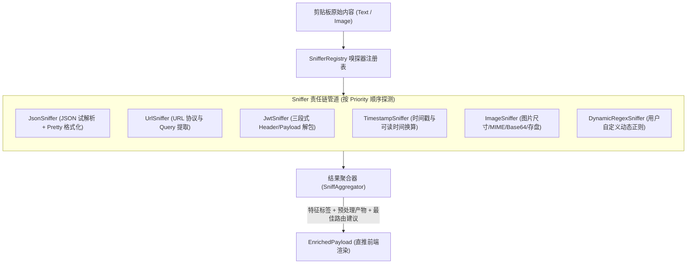
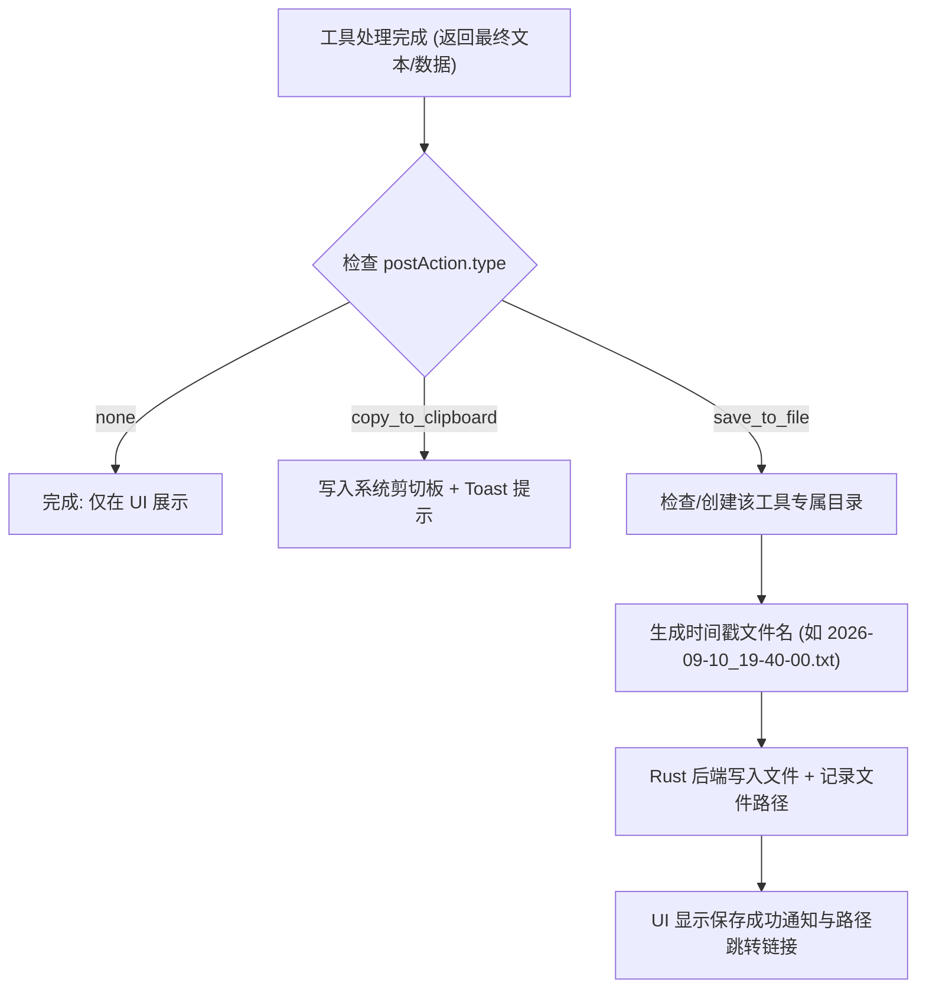

# 内容路由与工具系统规范 (Content Routing & Tool Engine Specification)

## 1. 架构原则: Rust 负责数据重核，Web 前端专职呈现

本系统的核心原则是：**“Web 前端尽量不处理数据，做好展示即可；所有剪贴板获取、内容嗅探、预处理与格式化完全由 Rust 后端承担”**。

```mermaid
flowchart TD
    subgraph Rust_Core["Rust 原生后端 (Heavy Data Engine)"]
        ClipManager["app.clipboard() 提取剪贴板 (Text / Image)"]
        Sniffer["Rust 内容嗅探器 (Sniffer: JSON/URL/JWT/Base64/Image)"]
        Preprocessor["Rust 预处理器 (Preprocessor: JSON格式化/URL解码/图片缓存)"]
        RouterEngine["Rust 路由仲裁器 (计算匹配得分与推荐工具)"]

        ClipManager --> Sniffer
        Sniffer --> Preprocessor
        Preprocessor --> RouterEngine
    end

    subgraph IPC_Transfer["Tauri IPC 通信"]
        EnrichedPayload["EnrichedPayload (包含原始数据、预处理结果与推荐工具)"]
        RouterEngine -->|app.emit('payload-ready')| EnrichedPayload
    end

    subgraph Web_Frontend["Web 前端 (Thin Frontend / Presentation)"]
        UI_Display["主工作台渲染: 代码高亮 / Markdown / 图像预览"]
        UI_Switch["工具栏切换与快捷操作"]

        EnrichedPayload --> UI_Display
        UI_Switch -.->|请求切换或重新处理| Rust_Core
    end
```

---

## 2. 内容载荷模型 (Enriched Content Payload)

Rust 后端通过 `app.clipboard()` 读取剪切板，完成嗅探和预处理后，封装为包含**预处理后数据 (Preprocessed Result)** 的结构体推送到前端：

```typescript
export type PayloadType = "text" | "image" | "files";

export interface TextMetadata {
  charCount: number;
  lineCount: number;
  detectedFormat: "json" | "url" | "jwt" | "xml" | "sql" | "cron" | "plain";
  decodingTrace?: string[]; // 解码链溯源，如 ['base64'] 或 ['hex', 'url']
}

export interface ImageMetadata {
  width: number;
  height: number;
  mimeType: string;
  byteSize: number;
  localCachePath: string; // 已在 Rust 端落盘的相对路径
  decodingTrace?: string[]; // 若图片是从 Base64/DataURL 解码而来，记录 ['base64']
}

export interface EnrichedPayload {
  id: string; // 唯一 UUID
  payloadType: PayloadType; // 'text' | 'image' | 'files'
  rawOriginal: string; // 剪贴板最原始捕获内容 (未经任何解码)
  actualContent: string; // 解码后进入嗅探的实际内容 (如解码后的纯文本或图片缓存路径)
  metadata: TextMetadata | ImageMetadata;
  tags: string[]; // 嗅探标签: ['format-json', 'decoded-from-base64']

  // Rust 端预处理好的直接可用结果 (前端零计算，直接用于渲染展示)
  preprocessedResult?: {
    formattedText?: string; // 如 Rust 格式化好的 Pretty JSON
    diffSource?: string; // 若存在对比的源数据
    suggestedOutputType: "json" | "text" | "markdown" | "image";
  };

  // 路由推荐结果
  recommendedToolId: string; // 最高匹配度的工具 ID
  candidateToolScores: Array<{ toolId: string; score: number }>; // 候选工具得分列表
  createdAt: number;
}
```

---

## 3. Rust 端前置解码与解包流水线 (Pre-Sniffing Decoding Pipeline)

在执行任何语义层面的嗅探与工具匹配前，**系统将 Base64、Hex、URL-Percent 等严格视为“数据编码形式”而非最终内容。必须先经过解码层还原真实实体，再进入嗅探流程**。

```mermaid
flowchart TD
    RawInput["剪贴板原始文本输入"] --> CheckEncoding{"编码探测器 (Decoder Chain)"}

    CheckEncoding -->|检测为 Base64 / DataURL| TryB64["尝试 Base64 解码为字节流 Vec&lt;u8&gt;"]
    CheckEncoding -->|检测为 Hex (十六进制)| TryHex["尝试 Hex 解码为字节流 Vec&lt;u8&gt;"]
    CheckEncoding -->|检测为 URL Percent 编码| TryUrl["尝试 URL Percent-decode"]
    CheckEncoding -->|无已知编码特征| DirectPass["原始文本直接进入嗅探"]

    TryB64 --> InspectBytes{"检查解码后字节流魔数与编码"}
    TryHex --> InspectBytes
    TryUrl --> DirectPass

    InspectBytes -->|命中图片魔数 (PNG/JPG/WebP/GIF)| UpgradeImage["载荷动态升格为 PayloadType::Image\n自动落盘至缓存目录\n记录 trace: ['base64']"]
    InspectBytes -->|有效 UTF-8 字符串 (可读文本/JSON)| TransformText["载荷内容替换为解码后文本\n记录 trace: ['base64'/'hex']"]
    InspectBytes -->|乱码或不可识别二进制| Revert["解码放弃: 还原为原始文本"]

    UpgradeImage --> SniffPipeline["进入下游 Sniffer 责任链与智能路由"]
    TransformText --> SniffPipeline
    DirectPass --> SniffPipeline
    Revert --> SniffPipeline
```

### 3.1 编码前置解耦的核心价值

1. **揭开内容真相 (Unpack to the Truth)**:
   - 用户复制了一串 Base64，其本质可能是一个被编码的 **JSON 报文**；
   - 若不解码，系统只能匹配到“Base64 转换工具”；
   - **通过前置解码**：先解码还原为 JSON 字符串，直接送入 `JsonSniffer`，系统直接展示格式化好的 Pretty JSON，并自动路由到 JSON 格式化工具！
2. **多模态图片编码自动升格**:
   - 常见场景：网页或代码中经常有 `data:image/png;base64,iVBORw0KGgo...` 或纯 Base64 图片；
   - 字节流魔数探测器检测到 `[0x89, 0x50, 0x4E, 0x47]` (PNG) 或 `[0xFF, 0xD8, 0xFF]` (JPEG)；
   - 系统立刻将载荷由 `Text` 动态提升为 `Image`，直接送入多模态工具（OCR、图片预览等），免除用户“先手动 Base64 转图片，再贴进 OCR 工具”的繁琐步骤。

### 3.2 解码过程中的鲁棒性防护

- **防止误伤短字符串**: 对过短的纯字母串（如 `"ABCD"` 或单纯单词）不进行激进解码，仅当长度适中、符合 Base64 填充规则或特定前缀（如 `0x`, `data:`）时才触发；
- **编码溯源链记录**: 解码后完整保留 `rawOriginal`，并在元数据记录 `decodingTrace: ["base64"]`。UI 界面将展示“💡 已自动通过 Base64 解码”，并支持一键切换查看原始编码。

---

## 4. Rust 端灵活可扩展嗅探体系 (Extensible Sniffer Architecture)

为了便于后期随需求随时无缝接入新的嗅探方式（例如新型数据结构、行业专属格式、用户自定义正则或脚本探测器），Rust 端采用 **基于 Trait 的插件化责任链管道设计 (Trait-based Plugin Pipeline)**。



### 3.1 核心 Trait 抽象 (`ContentSniffer`)

每个具体的嗅探器都是独立的 Rust 模块，只需实现 `ContentSniffer` Trait：

```rust
use async_trait::async_trait;

/// 嗅探输入源抽象
pub enum SniffInput<'a> {
    Text(&'a str),
    Image(&'a [u8]),
}

/// 嗅探产物
#[derive(Debug, Clone, Default)]
pub struct SniffOutput {
    pub matched: bool,                           // 是否命中该特征
    pub confidence: f32,                         // 置信度 (0.0 ~ 1.0)
    pub tags: Vec<String>,                       // 贡献的标签，如 vec!["format-json"]
    pub preprocessed_text: Option<String>,       // 可选: Rust 预处理好的文本 (如格式化后的 Pretty JSON)
    pub suggested_tool_id: Option<String>,       // 可选: 建议直达的工具 ID (如 "json-formatter")
    pub suggested_output_type: Option<String>,   // 可选: 推荐渲染类型 ("json", "markdown", "image")
    pub metadata: serde_json::Map<String, serde_json::Value>, // 提取出的附加元数据
}

/// 嗅探器插件标准 Trait
pub trait ContentSniffer: Send + Sync {
    /// 唯一标识符，如 "json-sniffer"
    fn id(&self) -> &'static str;

    /// 友好名称，如 "JSON Format & Syntax Sniffer"
    fn name(&self) -> &'static str;

    /// 探测优先级 (数值越大越早执行，范围 0 ~ 1000，默认 100)
    fn priority(&self) -> u32 { 100 }

    /// 是否支持该输入类型
    fn supports(&self, input: &SniffInput) -> bool;

    /// 执行核心嗅探与预处理
    fn sniff(&self, input: &SniffInput) -> SniffOutput;
}
```

#### 4.2 嗅探注册表与流水线调度 (`SnifferRegistry`)

系统维护一个单例的 `SnifferRegistry`，集中管理嗅探器生命周期：

```rust
pub struct SnifferRegistry {
    sniffers: Vec<Box<dyn ContentSniffer>>,
}

impl SnifferRegistry {
    pub fn new() -> Self {
        let mut registry = Self { sniffers: Vec::new() };
        // 注册系统默认内置嗅探器
        registry.register(Box::new(builtin::JsonSniffer::default()));
        registry.register(Box::new(builtin::UrlSniffer::default()));
        registry.register(Box::new(builtin::JwtSniffer::default()));
        registry.register(Box::new(builtin::TimestampSniffer::default()));
        registry.register(Box::new(builtin::ImageSniffer::default()));
        registry
    }

    /// 动态挂载新的嗅探器 (方便后期扩展)
    pub fn register(&mut self, sniffer: Box<dyn ContentSniffer>) {
        self.sniffers.push(sniffer);
        // 依照 priority 从大到小降序排列
        self.sniffers.sort_by(|a, b| b.priority().cmp(&a.priority()));
    }

    /// 调度管道执行，聚合所有嗅探器的标签与预处理结果
    pub fn execute(&self, input: &SniffInput) -> EnrichedPayload {
        let mut combined_tags = Vec::new();
        let mut best_confidence = 0.0f32;
        let mut selected_preprocessed = None;
        let mut recommended_tool_id = "plain-text-viewer".to_string();

        for sniffer in &self.sniffers {
            if sniffer.supports(input) {
                let output = sniffer.sniff(input);
                if output.matched {
                    combined_tags.extend(output.tags);

                    // 挑选最高置信度的预处理产物与推荐工具
                    if output.confidence > best_confidence {
                        best_confidence = output.confidence;
                        if let Some(prep) = output.preprocessed_text {
                            selected_preprocessed = Some(prep);
                        }
                        if let Some(tool_id) = output.suggested_tool_id {
                            recommended_tool_id = tool_id;
                        }
                    }
                }
            }
        }

        // 组装最终 EnrichedPayload 推送至前端
        EnrichedPayload {
            // ...
        }
    }
}
```

### 4.3 易扩展性体现与新嗅探器接入机制

得益于该架构，未来增加新的嗅探方式极其简单：

1. **接入新的硬编码内置格式**:
   - 只需新建文件（如 `src-tauri/src/sniffer/builtin/cron.rs`），实现 `ContentSniffer`，并在 `SnifferRegistry::new()` 中 `register(Box::new(CronSniffer))` 即可，对其他既有代码零侵入。
2. **接入声明式动态正则 (Dynamic Regex Sniffers)**:
   - 内置 `DynamicRegexSniffer`: 用户在前端 UI 或工具配置中添加了自定义工具的正则表达式，Rust 端会自动为该工具动态构造一个 `DynamicRegexSniffer` 实例注入到 Registry 中。
3. **性能防护与短路机制**:
   - 嗅探器采用快速预判（如快速检查首尾字符 `{` 或 `[`），避免对几十兆的大文本进行无谓的繁重解析。

---

## 5. 智能路由引擎与仲裁算法 (Smart Router & Arbitration)

智能路由的目标是达到**“用户在外部按下快捷键后，自动进入最合适工具，一键出结果”**的流畅体验。

### 5.1 工具匹配声明 (ToolMatcher Specification)

每个工具（无论是内置工具还是用户自定义工具）都需要声明其匹配规则：

```typescript
export interface ToolMatcher {
  // 接受的数据类型列表
  acceptedTypes: PayloadType[];

  // 正则匹配列表（命中任一即加分）
  patterns?: string[]; // 字符串形式的正则表达式

  // 必须匹配的特定格式嗅探标签 (由 Rust 嗅探器产出)
  requiredFormats?: string[]; // 如 ['format-json', 'format-url']

  // 自定义匹配逻辑（支持短匹配表达式）
  customPredicate?: string;

  // 默认基准权重 (0 ~ 100)
  basePriority: number;
}
```

### 5.2 匹配得分计算公式 (Scoring Algorithm)

当新的 `EnrichedPayload` 产生时，路由器对系统中所有处于启用状态（`enabled: true`）的工具计算一个匹配置信度得分 $S \in [0, 100]$：

1. **类型排斥检查**：
   若 `payload.payloadType` 不在工具的 `acceptedTypes` 中，**得分直接为 0**（彻底淘汰）。
   _例：输入为纯文本，而当前是 OCR 工具，OCR 工具匹配得分为 0。_
2. **特征与正则匹配**：
   - 若命中 `requiredFormats`（如 JSON 工具要求 `format-json` 标签），基础分加 50。
   - 若正则 `patterns` 命中，加分 $20 \times \text{命中数}$（上限 30）。
3. **自定义规则匹配**：
   - 若配置了自定义匹配表达式，根据执行结果加权。
4. **基准权重叠加**：
   加上工具自身的 `basePriority`（通常范围 1 ~ 10）。
5. **最终得分截断**：
   得分被截断在 $[0, 100]$ 区间。

### 5.3 路由决策与跳转策略 (Arbitration Strategy)

计算完所有工具得分后，设有以下状态：

- $T_{current}$: 当前 UI 处于激活状态的工具。
- $T_{best}$: 全局计算出的最高得分工具，其得分为 $S_{best}$。
- $S_{current}$: 当前工具对新内容的得分。

**路由流转规则**：

1. **强制纠偏跳转 (Mismatch Correction)**：
   若 $S_{current} == 0$（例如当前在 OCR 工具，但输入是文本）：
   - **立即自动切换到 $T_{best}$**，并展示处理结果。
2. **强特征命中跳转 (Strong Match Dominance)**：
   若 $S_{best} \ge 85$（例如输入了标准的 JSON，JSON 格式化工具得分高达 95），且 $S_{best} - S_{current} \ge 30$：
   - **自动切换到 $T_{best}$**，并在 UI 提供“返回上一工具”的快捷提示。
3. **粘性保持与候选推荐 (Sticky Selection & Quick Bar)**：
   若当前工具依然适用（$S_{current} > 40$），且与 $S_{best}$ 差距较小（$< 30$）：
   - **保持留在当前工具 $T_{current}$ 自动执行**。
   - 在界面顶部/侧边显示 **“推荐工具候选条”**（列出得分靠前的 top 3 工具，支持按快捷键如 `Alt + 1/2/3` 快速一键重放至其他工具）。

---

## 6. 工具模型与三大执行引擎规范 (Tool Providers)

系统中的每个工具遵循统一的定义规范，其核心为**三种处理引擎之一**：

```typescript
export type ToolType = "code" | "llm" | "cli";

export type PostActionType = "none" | "copy_to_clipboard" | "save_to_file";

export interface SaveToFileConfig {
  directory: string; // 保存目标目录 (每种工具可独立配置，如 "~/Documents/mtools/ocr")
  extension?: string; // 文件扩展名 (如 "txt", "json", "md"，默认根据输出自动推断)
  timeFormat?: string; // 时间文件名格式，默认 "YYYY-MM-DD_HH-mm-ss"
}

export interface PostActionConfig {
  type: PostActionType; // 默认 'none'
  saveConfig?: SaveToFileConfig;
  notifyOnSuccess?: boolean; // 完成后是否弹出 Toast / 系统通知 (默认 true)
}

export interface ToolDefinition {
  id: string; // 唯一标识 (如 'json-formatter', 'ai-translator')
  name: string; // 工具显示名称
  icon: string; // 图标 (Lucide 图标名或 svg)
  description: string; // 功能描述
  category: "developer" | "text" | "ai" | "utilities";
  isCustom: boolean; // 是否为用户自定义添加的工具
  enabled: boolean; // 是否启用
  matcher: ToolMatcher; // 匹配器定义
  type: ToolType; // 处理类型

  // 后置处理配置 (默认 type: 'none')
  postAction: PostActionConfig;

  // 根据 type 不同的具体配置参数
  codeConfig?: CodeToolConfig;
  llmConfig?: LLMToolConfig;
  cliConfig?: CLIToolConfig;
}
```

### 6.1 代码处理型 (Code Tool)

- **执行原则**: **内置常见代码处理（如 JSON 格式化、URL 解码、Base64/JWT 解包等）完全在 Rust 后端原生高效执行**。前端仅负责展示格式化后的结果。
- **用户自定义扩展**: 用户自定义编写的代码处理脚本支持配置纯 JS 代码或调用后端轻量运行时。
- **自定义规范**:
  ```typescript
  export interface CodeToolConfig {
    script: string;
    outputType: "text" | "json" | "markdown" | "diff";
  }
  ```
- **优点**: 极速运行（微秒到毫秒级）、前端零 CPU 负担、无掉帧与渲染卡顿。

### 6.2 大模型处理型 (LLM Tool)

- **运行环境**: 通过统一的 LLM 客户端驱动，向 OpenAI 兼容接口发送请求。
- **适用场景**: 多语言翻译、OCR 文字提取、语法润色纠错、代码解释、文章摘要等。
- **多模态特性**:
  - 当前主流大模型均已具备原生多模态支持。
  - 若 `payload.type === 'image'`，由 Rust 预处理完成的 Base64 图片或缓存路径直接打包注入到多模态消息体中。
- **配置模型**:
  ```typescript
  export interface LLMToolConfig {
    useSystemProvider: boolean; // 是否沿用系统全局大模型配置
    customProviderId?: string; // 若为 false，指定独立的服务商 ID
    customModel?: string; // 指定模型名称 (如 qwen-vl-max / gpt-4o 等)
    temperature?: number;
    systemPrompt: string; // 预置系统提示词
    userPromptTemplate: string; // 用户提示词模板，支持变量 {{input}}
    stream: boolean; // 是否启用流式输出打字机效果
  }
  ```

### 6.3 外部命令型 (CLI Tool)

- **运行环境**: Tauri 后端 Rust 子进程 (`std::process::Command`)。
- **安全准则**: **由用户显式指定命令与参数，并由用户自行负责其安全性。** 系统不作黑名单强行拦截，但向用户展示清晰的执行预览。
- **适用场景**: 调用系统级 CLI 工具（如 `jq`, `prettier`, `pandoc`, `curl`, `ffmpeg`, 自定义 Python/Bash 脚本等）。
- **通信通道**:
  - 输入：将文本内容作为外部进程的标准输入 (`stdin`) 传入；或若是图片/文件，将本地缓存文件路径作为参数 `{{filePath}}` 传入。
  - 输出：捕获标准输出 (`stdout`) 作为结果；标准错误 (`stderr`) 用于错误提示或排查日志。
- **配置规范**:
  ```typescript
  export interface CLIToolConfig {
    command: string; // 可执行文件路径或命令 (如 "jq", "python3")
    args: string[]; // 参数列表 (支持占位符: {{filePath}}, {{input}})
    workingDir?: string; // 工作目录
    stdinMode: "pipe" | "none"; // 是否将文本内容通过 stdin 流式灌入
    timeoutMs: number; // 超时限制 (默认 10000ms)
    env?: Record<string, string>; // 自定义环境变量
  }
  ```

---

## 7. 工具后置处理管道 (Post-Processing Actions Pipeline)

工具执行产生结果后，可自动触发配置的后置处理钩子。默认状态为 `none`（仅在界面呈现），用户可针对每个工具独立指定以下动作：



### 7.1 后置动作说明

1. **无 (None - 默认)**:
   - 结果仅渲染在工作台右侧输出区，由用户在界面上自主选择后续操作（手动点击复制、重新处理等）。
2. **复制结果到剪切板 (Copy to Clipboard)**:
   - 处理成功后（若是流式大模型输出，则在输出流全部完成时），自动将完整文本写回操作系统剪贴板。
   - 界面弹出轻量 Toast 提示“已复制处理结果”。
3. **保存结果为文件 (Save to File)**:
   - **每种工具专属目录**: 工具配置中指定 `saveConfig.directory`（例如 OCR 工具可指定 `~/Documents/mtools/ocr/`，翻译工具可指定 `~/Documents/mtools/translations/`）。若目录不存在，Rust 后端自动递归创建 (`std::fs::create_dir_all`)。
   - **按时间命名**: 以当前生成时间戳命名文件，例如 `2026-09-10_19-40-26.txt`（或 `.json`, `.md`）。
   - **防止同秒覆盖**: 若一秒内产生多次保存，自动在末尾追加自增序号 `_1`, `_2`。
   - 保存完成后，文件绝对路径自动记录至本条历史记录中，UI 提供“在文件管理器中打开”的快捷操作。

---

## 8. 工具管理 (增删改查与导入导出)

1. **内置工具池 (Built-in Tools)**:
   - 随应用发布，自带最佳实践的 Prompt 与高效 JS 脚本（如 JSON Formatter, Base64/URL Converter, AI Translator, AI Multimodal OCR, Shell Executor）。
   - 内置工具支持修改后置动作、调整优先级与配置，不可删除核心定义。
2. **用户自定义工具 (Custom Tools)**:
   - UI 提供专门的**“新建工具”向导**：用户可选择工具类型（Code / LLM / CLI），填写工具名称、匹配规则、执行逻辑、以及**专属后置处理行为（默认无 / 自动复制 / 指定目录时间戳存盘）**。
   - 支持将所有自定义工具导出为 JSON 文件进行备份，或从文件/URL 导入社区工具预设。
