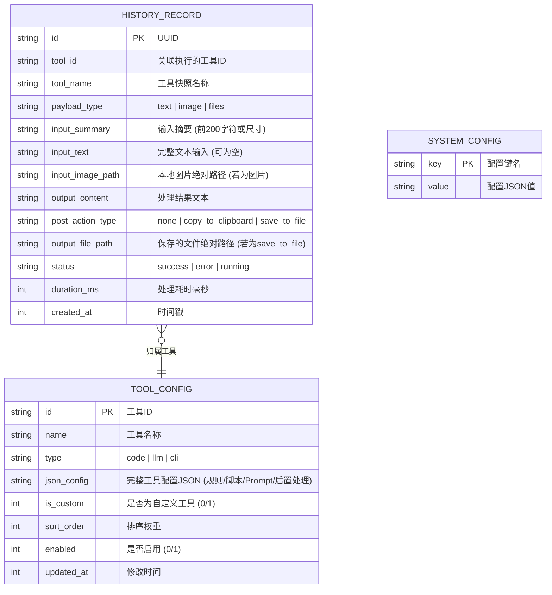
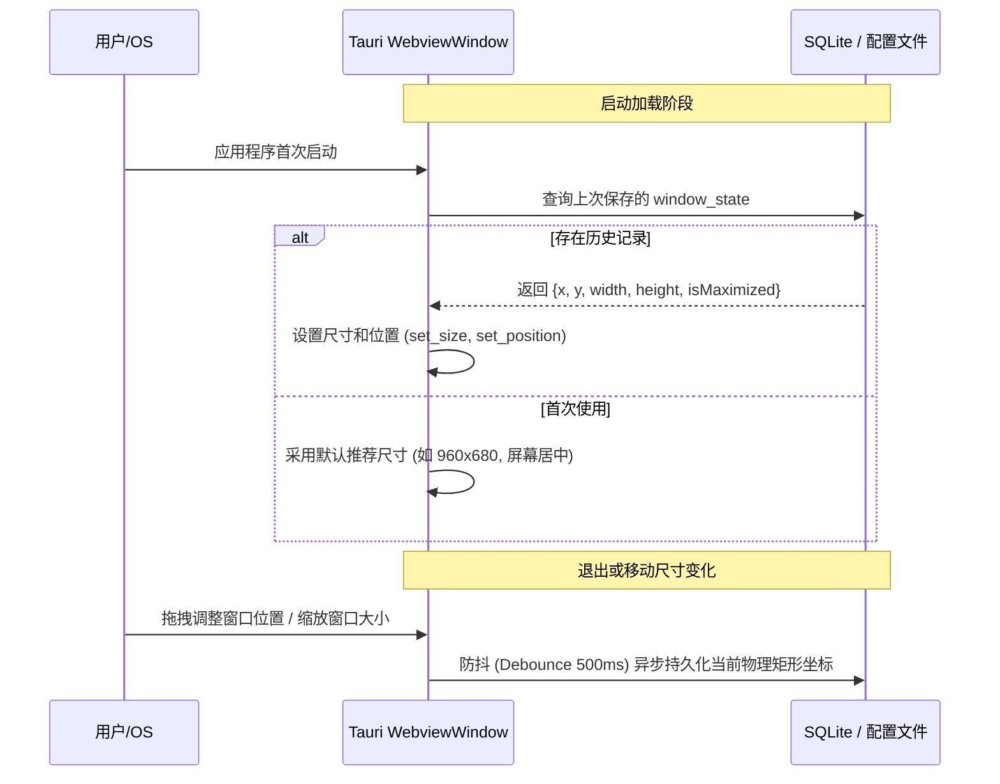

# 存储体系与 UI/UX 交互规范 (Storage & UI/UX Design)

## 1. 存储设计与历史回溯引擎 (History & Storage Architecture)

为了保证快速响应和海量历史记录检索能力，系统采用 **本地 SQLite + 文件系统持久化** 的混合存储模式。



### 1.1 历史记录数据表设计 (History Schema)

```sql
CREATE TABLE IF NOT EXISTS history_records (
    id TEXT PRIMARY KEY,
    tool_id TEXT NOT NULL,
    tool_name TEXT NOT NULL,
    payload_type TEXT NOT NULL,
    input_summary TEXT NOT NULL,
    input_text TEXT,
    input_image_path TEXT,
    output_content TEXT,
    post_action_type TEXT DEFAULT 'none',
    output_file_path TEXT,
    status TEXT NOT NULL,
    duration_ms INTEGER DEFAULT 0,
    created_at INTEGER NOT NULL
);

CREATE INDEX IF NOT EXISTS idx_history_tool_id ON history_records(tool_id);
CREATE INDEX IF NOT EXISTS idx_history_created_at ON history_records(created_at DESC);
```

### 1.2 媒体文件持久化策略 (Image Cache Management)

为确保本地文件易于辨识、避免单目录文件过多导致文件系统性能下降与磁盘过度膨胀，媒体缓存采用**“时间分级命名 + 配额与生命周期自动巡检”**策略。

#### 1. 可读时间命名与分级目录结构

- **年月分级目录**: 将图片按月份分文件夹归档，格式为 `$APP_DATA_DIR/cache/images/YYYY-MM/`，避免数千张图片堆积在单一目录导致文件管理器卡顿。
- **时间戳文件命名**: 使用秒级人类可读时间作为文件名，例如：
  `$APP_DATA_DIR/cache/images/2026-09/2026-09-10_19-46-48.png`
- **同秒冲突消解**: 若用户在同一秒内连续多次触发截图/复制图片，自动在末尾追加顺序号，如 `2026-09-10_19-46-48_1.png`。
- **数据库轻量引用**: 数据库 `history_records.input_image_path` 仅存储相对路径（如 `images/2026-09/2026-09-10_19-46-48.png`），避免绝对路径绑定便于迁移。

#### 2. 应对图片文件过多与磁盘膨胀的四重防护机制

为了彻底避免长期使用后磁盘被图片撑爆或文件过多，系统内置以下机制：

1. **配额上限与 FIFO 淘汰 (Quota Pruning)**:
   - 系统设置中提供**“图片缓存上限”**（默认限制 `500 MB` 或 `1000 张`）。
   - 当缓存目录达到阈值时，后台按文件创建时间从旧到新自动淘汰清理最老的缓存文件，并置空对应旧历史记录中的图片指针（保留文本摘要与结果，仅释放图片字节）。
2. **存留期过期淘汰 (TTL Strategy)**:
   - 默认仅保留近 **30 天**内的缓存图片（用户可在系统设置中调节为 7天 / 30天 / 90天 / 永久）。
   - 应用程序启动或休眠唤醒时，后台异步任务批量扫描超过 TTL 的历史月份目录并安全清理。
3. **历史记录联动删除与孤立文件清理 (Garbage Collection)**:
   - **联动删除**: 当用户在 UI 的历史记录抽屉中手动删除某条含图片的记录时，Rust 端立即从磁盘物理删除对应图片文件。
   - **孤立巡检**: 每周或手动触发清理时，扫描缓存目录，比对数据库索引，清理所有未被任何历史记录引用的孤立图片残卷。
4. **可视化设置与一键清理 (UI Control)**:
   - 系统设置面板中增加“存储与缓存”专区，实时统计显示：`当前图片缓存占用：128.5 MB (共 423 张)`。
   - 提供**“一键清空图片缓存”**按钮，允许用户随时安全释放全部历史图片。

---

## 2. 窗口行为与几何尺寸记忆 (Window State Management)

根据产品明确决策，本软件采用**普通桌面窗口，记住上一次位置与大小**的模式。



---

## 3. UI 界面布局结构与交互设计 (UI/UX Architecture)

前端基于 **Vue 3 + Tailwind CSS** 构建现代、简洁、高信息密度的开发者与效率工具界面。整体支持明暗两套主题切换。

### 3.1 主界面宏观布局 (Main Workspace)

```
+-------------------------------------------------------------------------------+
|  [Logo] mtools    |  [推荐工具候选: JSON格式化 (Alt+1) | 翻译 (Alt+2)] | [设置] [历史] |
+-------------------+-----------------------------------------------------------+
| 工具导航栏 (侧边)   | 主工作台区                                                 |
|                   |                                                           |
| [ 搜索工具...   ]  | +-----------------------------+ +-----------------------+ |
|                   | | 输入区 (支持编辑/重新粘贴)     | | 处理结果区 (Markdown/代码) | |
| > JSON 格式化 (⭐) | |                             | |                       | |
|   AI 翻译         | |                             | |                       | |
|   多模态 OCR      | |                             | |                       | |
|   URL 编解码      | |                             | |                       | |
|   外部 CLI 命令   | +-----------------------------+ +-----------------------+ |
|                   |                                                           |
| ----------------- | 底部操作栏:                                               |
| [ + 新增自定义工具 ]| [复制结果到剪贴板] [在源应用粘贴] [重新执行] [耗时: 12ms]   |
+-------------------+-----------------------------------------------------------+
```

### 3.2 核心交互模块规范

#### 1. 便捷工具切换 (Tool Switching & Keyboard Shortcuts)

- **全局快捷键**: 选中文本后快捷键启动，直接呼出并路由。
- **界面内快速切换**:
  - `Cmd/Ctrl + K`: 呼出工具搜索面板（Command Palette），快速模糊搜索并激活工具。
  - `Alt + 1 ~ 9`: 快速跳转到左侧收藏/常用工具或顶部推荐候选工具。
  - 方向键 `Up / Down`: 在侧边工具栏中快速上下浏览切换。

#### 2. 工具增删与管理中心 (Tool Manager Drawer/Modal)

- 侧边栏底部提供明显的 `+ 新增工具` 按钮。
- 新增/编辑工具弹窗支持 3 种向导模式：
  - **模式 1: 纯代码工具**：提供内嵌代码编辑器，支持直接编写 JS 函数并提供实时测试输入框。
  - **模式 2: AI 大模型工具**：填写 Prompt 模板、选择模型（默认继承系统或自定义）、多模态支持说明。
  - **模式 3: 外部 CLI 命令工具**：填写命令行（如 `jq .`）、工作目录、参数模板，并显示安全性告知与风险确认。
- **通用后置处理配置区 (Post-Processing Settings)**：
  - 单选后置动作：`无（默认）` | `自动复制到系统剪切板` | `自动保存为文件`。
  - 若勾选“保存为文件”：弹出目录选择器选择当前工具的专属保存目录（如 `~/Documents/mtools/ocr/`），并显示基于时间戳命名的文件预览（例如：`2026-09-10_19-40-26.txt`）。
- 支持右键已建工具：进行“编辑”、“重命名”、“调整排序”、“导出配置”或“删除（仅自定义工具）”。

#### 3. 历史记录抽屉 (History Drawer)

- 点击顶部“历史”图标或按下 `Cmd/Ctrl + H` 打开历史侧边抽屉。
- 抽屉特性：
  - 时间线倒序排列，包含：执行工具标签、时间距离（如“5分钟前”）、输入简略摘要、成功/失败状态。
  - **后置动作标识**：若执行了自动复制，卡片显示 `📋 已复制` 徽标；若执行了自动保存文件，显示 `📁 已存盘` 徽标，点击可直接在系统的文件管理器中定位该文件。
  - 支持根据工具筛选（如只看“翻译”历史，或只看“OCR”历史）。
  - 支持全文关键词检索。
  - **一键回溯**: 点击任一历史卡片，即可将当时的输入与输出完整恢复至主工作台，便于二次编辑或重新复制。

#### 4. 系统设置面板 (Settings Modal)

- **大模型配置 (LLM Providers)**:
  - 列表式管理多个服务商（OpenAI, DeepSeek, 阿里百炼, Ollama 等）。
  - 一键“测试连接”功能（发送轻量请求验证 API Key 与 Base URL 可达性）。
  - 设定系统全局默认使用的服务商与模型。
- **外观与快捷键**:
  - 主题切换：浅色模式、深色模式、跟随系统。
  - 快捷操作配置：“执行完成后自动复制到剪贴板”、“复制后自动最小化”等。
